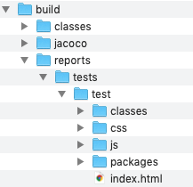
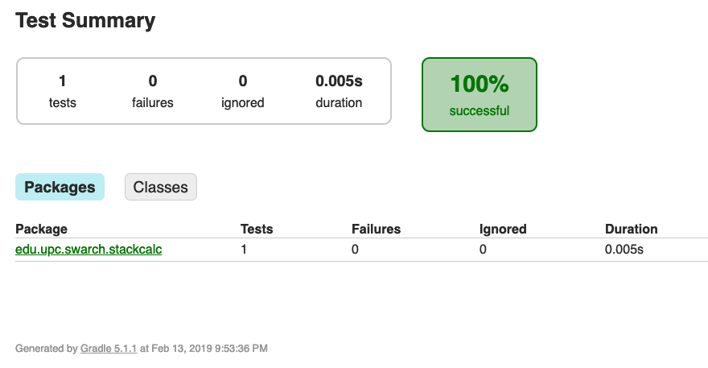
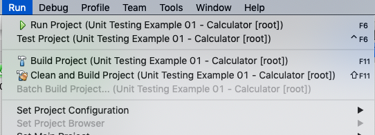
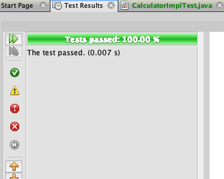
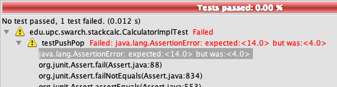
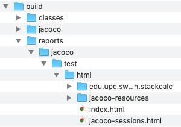
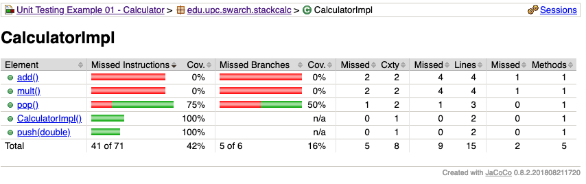

# Unit testing lab

Table of contents:

* [Compiling the code](#compiling-the-code)
    * [From the command line](#from-the-command-line)
    * [From Netbeans](#from-netbeans)
* [Testing the code](#testing-the-code)
    * [From the command line](#testing-from-the-command-line)
    * [From Netbeans](#testing-from-netbeans)
* [Measuring the code coverage](#measuring-code-coverage)
* [TO-DO tasks](#to-do-tasks)

Requirements:
* To program: any text editor or IDE (Netbeans, Eclipse, IntelliJ IDEA, Visual Studio Code, Atom...)
    * In the classroom, we will use Netbeans with the Gradle plugin
* To compile and test: a console (Linux or Mac recommended, but Windows should work, too)

## Compiling the code

### From the command line

From the console, in the `part01_calculator` folder, run:

* Linux/Mac: `./gradlew clean build`
* Windows: `gradlew.bat clean build`

### From Netbeans

Execute the _"Build"_ command.

## Testing the code

### Testing from the command line

From the console, in the `part01_calculator` folder, run:

* Linux/Mac: `./gradlew test`
* Windows: `gradlew.bat test`

If tests passed, you will see `BUILD SUCCESSFUL` in the command line.

If tests failed, you will see which line failed, and some details about the test failure:

```
part01_calculator$ ./gradlew test

> Task :test FAILED

edu.upc.swarch.stackcalc.CalculatorImplTest > testPushPop FAILED
    java.lang.AssertionError: expected:<14.0> but was:<4.0>
        at org.junit.Assert.fail(Assert.java:88)
        at org.junit.Assert.failNotEquals(Assert.java:834)
        at org.junit.Assert.assertEquals(Assert.java:553)
        at org.junit.Assert.assertEquals(Assert.java:683)
        at edu.upc.swarch.stackcalc.CalculatorImplTest.testPushPop(CalculatorImplTest.java:21)

1 test completed, 1 failed

FAILURE: Build failed with an exception.
```

In addition to the console output, Gradle will create an `index.html` file in the `build/reports/tests/test/` folder:



If you open it, it will show you a complete report of the passed/failed tests:



### Testing from Netbeans

From the menu, select _Run_ --> _Test Project_:



If tests pass, the _Test results_ tab will be shown in green.



If tests fail, the _Test results_ tab will be shown in red, with more info about the failed tests.



## Measuring code coverage

Code coverage allow us to see which parts of our code have been tested (this is, which classes,
methods and lines have been executed in tests).

Generally speaking, a code coverage around 90% could be considered a good code coverage rate.

From the console, in the `part01_calculator` folder, run:

* Linux/Mac: `./gradlew test jacocoTestReport`
* Windows: `gradlew.bat test jacocoTestReport`

It will create a file named `index.html` under the `build/reports/jacoco/test/html/` folder:



If you open it, it will allow you navigating through a report that will show you code coverage
insights:



## TO-DO tasks

### Task 1: Increase code coverage

Taking `testPushPop()` implementation as a reference, create, at least, the following tests:

* `testAdd`: checks that the `add` method works correctly.
* `testMult`: checks that the `mult` method works correctly

To check more assertion methods, you can have a look to the
[JUnit Assert Javadoc](http://junit.sourceforge.net/javadoc/org/junit/Assert.html).

### Task 2: add more methods to `Calculator` interface and `CalculatorImpl` class

Create **and test** the following methods:

* `sub`: subtracts the two elements on the top of the stack, and leaves the result in the stack.
* `div`: divides the two elements on the top of the stack, and leaves the result in the stack.
* `neg`: negates (inverts signum) of the element on the top of the stack.

### Task 3: assert exceptions

Some methods may throw an exception. It's also a good practice to test not only the _"happy path"_
but also the error cases.

For example, test that if you invoke the `add` method with less than 2 elements in the stack, an
`StackSizeException` is thrown. For that, you can use the [expected argument of the @Test annotation](http://junit.sourceforge.net/javadoc/org/junit/Test.html#expected())
(see examples in the link).