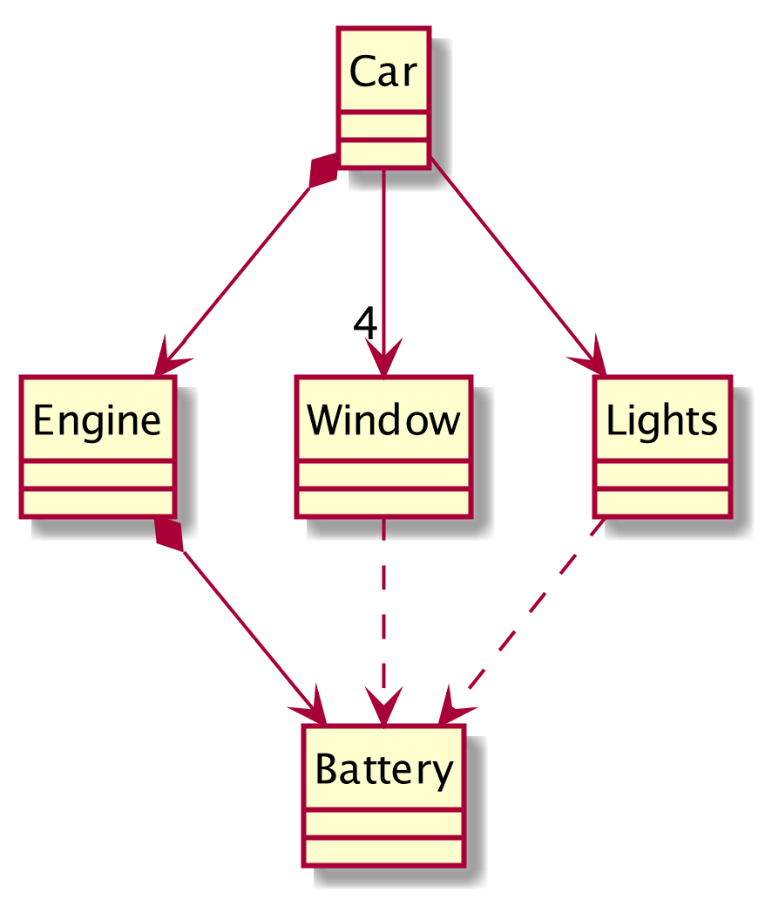

# Unit Testing
## Lesson 01

[Mario Macías](http://macias.info)

Software Architecture

Universitat Politècnica de Catalunya

---

## The testing problem

* Before delivering our code to the user, it needs to be **tested**
  - We need to check that all the desired functionalities are correctly fulfilled.
* <!-- .element: class="fragment" --> **Toil work**: slow, boring, repetitive, prone to human error. 

---

## Testing is fragile

<div style="display: flex">
<div style="flex: 1.5">
<p>Something that yesterday worked, could not work today.</p>
<p>A change in a component could propagate to the whole system</p>
<p class="fragment">**We need to re-test all the system after a small change**</p>
</div>
<div style="flex: 1">

</div>
</div>

---

## Tests need to be automated

* That's what are computer programs for!
* Let's write a program that tests our code for us.

---

## Unit testing

* We test the **public** behavior of our classes.
  * <!-- .element: class="fragment" --> **GIVEN** a class
  * <!-- .element: class="fragment" --> **WHEN** we invoke a method with a given input
  * <!-- .element: class="fragment" --> **THEN** an expected output is returned

---

## Unit test: example

### Test case: Stack Calculator push
- <!-- .element: class="fragment" --> *GIVEN* a stack calculator
- <!-- .element: class="fragment" --> *WHEN* several numbers are pushed to the stack.
- <!-- .element: class="fragment" --> *THEN* The numbers can be popped "Last-In, First-Out"

---

## Java [JUnit](http://junit.org) example

```java
package edu.upc.swarch.lesson01.part1;

import org.junit.Test;
import static org.junit.Assert.*;

public class CalculatorTest {
    @Test
    public void testPushPop() {
        /* Contents of the test here */
    }
}
```

---

## Java [JUnit](http://junit.org) example

### Contents of the push test

```java
// Given a calculator
Calculator c = new CalculatorImpl();

// When several numbers are pushed to the stack
c.push(1.0);
c.push(2.0);
c.push(3.0);
c.push(4.0);

// The numbers are popped in a "Last-In, First-Out" way
final double delta = 0.00001;
assertEquals(4.0, c.pop(), delta);
assertEquals(3.0, c.pop(), delta);
assertEquals(2.0, c.pop(), delta);
assertEquals(1.0, c.pop(), delta);
```

---

## Fragment Styles

There's different types of fragments, like:

grow    <!-- .element: class="fragment grow" -->

shrink  <!-- .element: class="fragment shrink" -->

fade-out    <!-- .element: class="fragment fade-out " -->

fade-up (also down, left and right!) <!-- .element: class="fragment fade-up" -->

current-visible <!-- .element: class="fragment current-visible" -->

Highlight <span class="fragment highlight-red">red</span> <span class="fragment highlight-blue">blue</span> <span class="fragment highlight-green">green</span>

---


## Tabular Tables
| Tables        | Are           | Cool  |
| ------------- | :-----------: | ----: |
| col 3 is      | right-aligned | $1600 |
| col 2 is      | centered      | $12   |
| zebra stripes | are neat      | $1    |

---


