# Using plain Standard Query Language (SQL)

To avoid having to install an SQL Database Software (MySQL, PostgreSQL, Oracle...) this project
includes an embedded [H2 Database](http://www.h2database.com/). A relational database engine
written in Java with support for the SQL Standard.

You just have to run this project from Netbeans (or any other IDE), or just run this command from
the terminal:

```
./gradlew run
```

(or `gradlew.bat run` if you are using Windows)

And this will run the H2 engine in background. To submit SQL commands, you have two options:
using the embedded, browser-based console, or using an SQL GUI tool. The following two sections
explain how to connect with the embedded terminal and with Netbeans.

## Connect to H2 using the browser-based console

When you run the application with `./gradlew`, you can open the `http://localhost:8080` address
in your browser. The following form will appear:

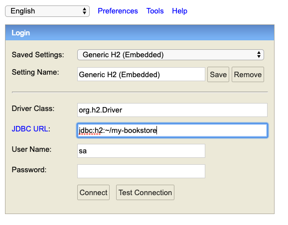

Make sure the data is the same as in the avobe image.

In `JDBC URL`, you can modify the `~/my-bookstore` part by the folder where you want your
database to be stored.

After you click the `Connect...` button, the following screen will appear:

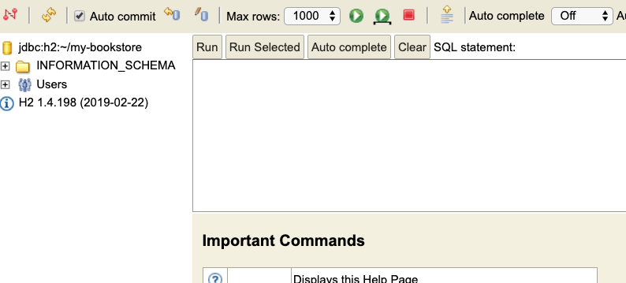

In the text box in the middle, you can write the SQL commands of this tutorial. To run them,
just push the green _play_ button.

## Connect to H2 using Netbeans

1. In the left pane of Netbeans, select the **Services** tab, and extend the "Databases"
   folder:
 
   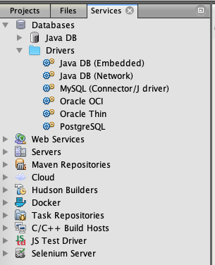

2. If you see an entry named "H2 Database Engine", jump to step 8. If not, continue by step 3.

3. Go to the H2 download page (http://www.h2database.com/html/download.html) and download
   and uncompress the platform independent zip of the latest version.

4. Right-click on the **Drivers** folder and select **New Driver...**

   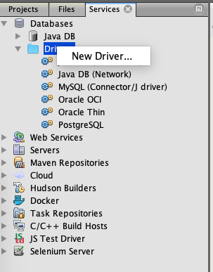

5. In the form, select **Add...** 

   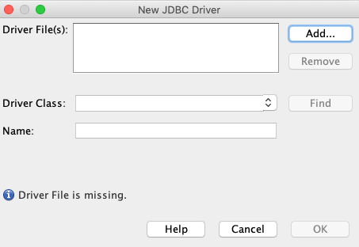

6. Navigate to the file named `h2-1-4-198.jar` of the uncompressed file that you downloaded in step
   3, and select it. 

   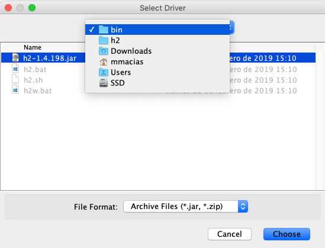

7. The "New JDBC Driver" form now should look similar to this:

   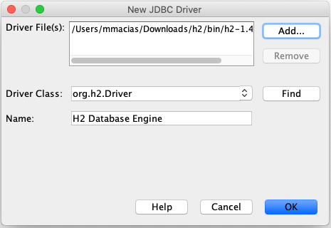
   
8. Right-click on `H2 Database Engine` and select **Connect Using...**

   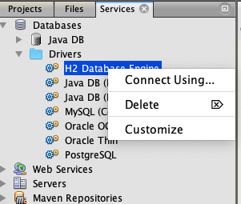
   
9. Make sure the "New Connection Wizard" form looks like this:

   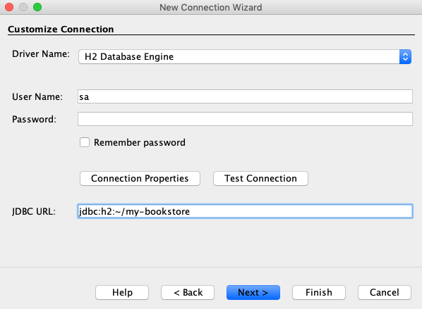
   
   (In `JDBC URL`, you can modify the `~/my-bookstore` part by the folder where you want your
    database to be stored) 

10. Now you can click "Finish"

11. In the databases view, a new entry appears. Right click and select "Execute command..." 

    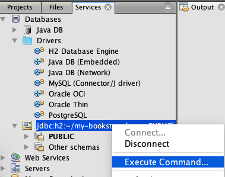

12. The following window appears. You can write the SQL commands of this tutorial in the text box.
    To execute them, just click the left icon "Run SQL", next to the Connection selector.

    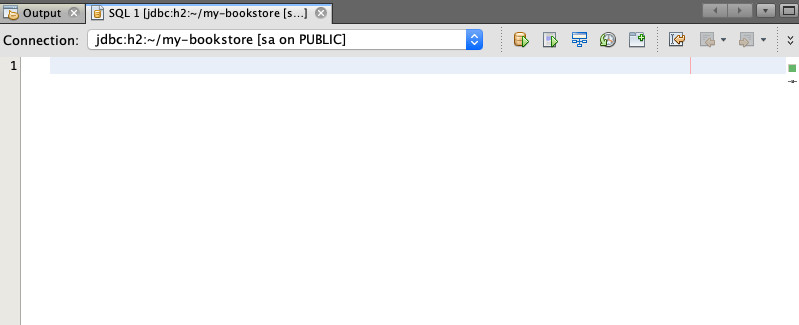


```SQL
CREATE SCHEMA Books;
USE Books;
--------
CREATE TABLE AUTHORS (
   ID INT NOT NULL PRIMARY KEY AUTO_INCREMENT,
   Name VARCHAR(256) NOT NULL
);
CREATE TABLE Books (
   ISBN varchar(32) UNIQUE NOT NULL,
   Title varchar(256) NOT NULL,
   Year int,
   AuthorID INT,
   FOREIGN KEY (AuthorID) REFERENCES Authors(ID)
);
----------
INSERT INTO Authors(Name) VALUES
('Miguel de Cervantes'), ('Milan Kundera'),
('William Shakespeare'), ('Pep Guardiola'),
('Manuel Vazquez Montalban');
-----------
SELECT * FROM Authors;
SELECT * FROM Authors ORDER BY Name;
-----------

INSERT INTO Books(ISBN, TITLE, YEAR, AUTHORID)
VALUES('123-3-43-343331-3', 'Don Quijote de la Mancha', 1605, (SELECT Id FROM Authors WHERE Name = 'Miguel de Cervantes'))
Breaking Primary key:
INSERT INTO Books(ISBN, TITLE, YEAR, AUTHORID)
VALUES('123-3-43-343331-3', 'Hamlet', 1609, (SELECT Id FROM Authors WHERE Name = 'William Shakespeare'))
Breaking referential integrity of foreign key:
INSERT INTO Books(ISBN, TITLE, YEAR, AUTHORID)
VALUES('111-11-1-111111-1', 'Momo', 1973, 7)
Breaking Non-Nullity constraint:
INSERT INTO Books(ISBN, YEAR, AUTHORID)
VALUES('111-11-1-111111-1', 2009, (SELECT Id FROM Authors WHERE Name = 'Pep Guardiola'))
--------------
INSERT into books(isbn, title, year, AuthorID) VALUES
('111-1-11-111111-1', 'Hamlet', 1603, (SELECT Id FROM AUTHORS WHERE Name = 'William Shakespeare')),
('222-2-22-222222-2', 'Laughable Loves', 1969, (SELECT Id FROM AUTHORS WHERE Name = 'Milan Kundera')),
('333-3-33-333333-3', 'Rinconete and Cortadillo', 1613, (SELECT Id FROM AUTHORS WHERE Name = 'Miguel de Cervantes')),
('444-4-44-444444-4', 'The unbearable lightness of being', 1984, (SELECT Id FROM AUTHORS WHERE Name = 'Milan Kundera'));
---------------
SELECT * FROM BOOKS ORDER BY YEAR DESC
SELECT * FROM BOOKS WHERE Year > 1900 ORDER BY YEAR DESC
SELECT Title, Year FROM BOOKS WHERE Year > 1900 ORDER BY YEAR DESC
SELECT COUNT(*) FROM BOOKS Where year > 1900;
----------------------
SELECT Books.Title, Books.Year, Authors.Name as Author FROM BOOKS, Authors WHERE Books.AuthorID = Authors.ID;
----------------------
DELETE FROM BOOKS where isbn = '333-3-33-333333-3'
Breaking referential integrity:
DELETE FROM Authors WHERE Name = 'Milan Kundera'
-----------------------
Workarounds
CREATE TABLE Books (
   ISBN varchar(32) UNIQUE NOT NULL,
   Title varchar(256) NOT NULL,
   Year int,
   AuthorID INT,
   FOREIGN KEY (AuthorID) REFERENCES Authors(ID)
);
(poner quizas un alter table)
or, Delete first all the books from the author:
DELETE FROM Books WHERE AuthorID = (SELECT id FROM Authors WHERE Name = 'Milan Kundera');
DELETE FROM Authors WHERE Name = 'Milan Kundera';
--------------------

```

